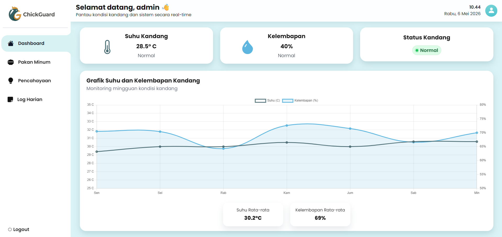

# ChickGuard

ChickGuard adalah aplikasi web berbasis PHP untuk monitoring kandang ayam. Proyek ini menyediakan dashboard ringkas, pengelolaan jadwal pencahayaan, jadwal pakan dan minum, serta log harian dalam satu antarmuka admin.



## Fitur
- Login admin berbasis session.
- Lupa password dan reset password menggunakan token.
- Dashboard monitoring dengan ringkasan suhu, kelembapan, status kandang, dan grafik mingguan.
- Manajemen jadwal pencahayaan: tambah, ubah, hapus, dan pagination.
- Manajemen jadwal pakan dan minum: tambah, ubah, hapus, dan pagination.
- Log harian dengan pencarian, pagination, pilihan jumlah baris, dan hapus massal.
- Seed data otomatis untuk tabel utama saat halaman fitur diakses.

## Teknologi
- PHP native
- MySQL / MariaDB
- Bootstrap 5
- Chart.js
- Bootstrap Icons dan Font Awesome

## Struktur Proyek
```text
chick/
|-- index.php
|-- login.php
|-- reset_password.php
|-- tambah_admin.php
|-- config/
|   `-- koneksi.php
|-- database/
|   `-- chickguard.sql
|-- pages/
|   |-- dashboard.php
|   |-- pencahayaan.php
|   |-- pakan_minum.php
|   `-- log_harian.php
|-- proses/
|   |-- init_tables.php
|   |-- proses_login.php
|   |-- proses_lupa_password.php
|   |-- proses_reset_password.php
|   |-- proses_pencahayaan.php
|   |-- proses_pakan_minum.php
|   |-- proses_log_harian.php
|   |-- filter_log_harian.php
|   `-- logout.php
|-- componets/
|   |-- sidebar.php
|   `-- topbar.php
`-- assets/
    |-- css/
    |-- images/
    `-- vendor/
```

Catatan: folder shared layout pada repo saat ini bernama `componets`, bukan `components`.

## Persiapan Lokal
1. Letakkan folder proyek di `C:\xampp\htdocs\chick`.
2. Jalankan Apache dan MySQL dari XAMPP.
3. Buat database `chickguard` di phpMyAdmin.
4. Import file `database/chickguard.sql`.
5. Sesuaikan koneksi database di `config/koneksi.php` bila username, password, atau host MySQL Anda berbeda.
6. Buka `http://localhost/chick/`.

## Akun Demo
- Username: `admin`
- Email: `admin@chickguard.local`
- Password default: gunakan akun admin dari data SQL yang diimpor.

Jika perlu membuat admin baru secara manual, gunakan `tambah_admin.php`.

## Alur Halaman
- `index.php`: pengarah awal aplikasi.
- `login.php`: login admin dan form lupa password.
- `reset_password.php`: set password baru dari token reset.
- `pages/dashboard.php`: tampilan ringkas monitoring.
- `pages/pencahayaan.php`: pengelolaan jadwal lampu.
- `pages/pakan_minum.php`: pengelolaan jadwal pakan dan minum.
- `pages/log_harian.php`: pencarian dan pengelolaan log harian.

## Catatan Implementasi
- Dashboard saat ini masih memakai data simulasi pada sisi frontend untuk suhu dan kelembapan.
- Tabel `jadwal_pencahayaan`, `jadwal_pakan_minum`, `log_harian`, dan `password_resets` akan dibuat atau dilengkapi melalui `proses/init_tables.php` saat halaman terkait dibuka.
- Beberapa library frontend tersedia di `assets/vendor`, tetapi halaman utama saat ini masih memuat Bootstrap, Chart.js, dan ikon dari CDN.

## Pengembangan Lanjutan
- Integrasi sensor IoT untuk data real-time.
- Sinkronisasi kontrol lampu, pakan, dan minum ke perangkat fisik.
- Notifikasi otomatis saat kondisi kandang di luar batas aman.
- Pemisahan role pengguna selain admin.

## Lisensi
Belum ada file lisensi terpisah di repo ini. Jika proyek akan dipublikasikan, tambahkan lisensi yang sesuai.
